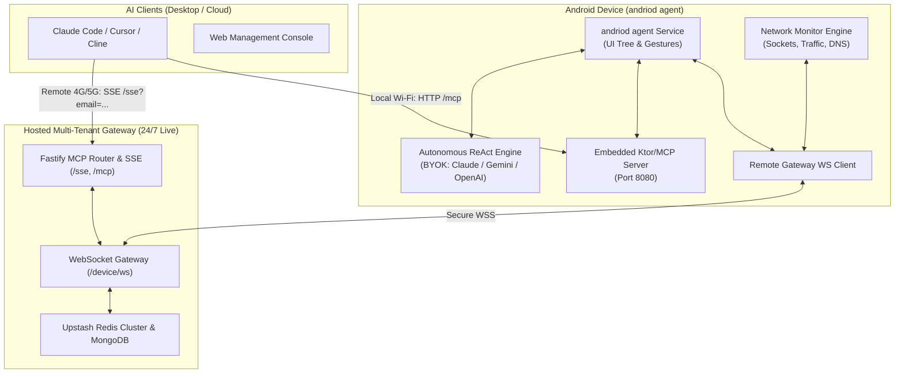

# andriod agent 🤖📱

[](https://opensource.org/licenses/Apache-2.0)
[](https://developer.android.com)
[](https://fastify.io)
[](https://modelcontextprotocol.io)
[](https://github.com/charantek1styearbtech/andriod-mcp/releases)

An open-source, autonomous AI agent and **Model Context Protocol (MCP)** server running directly on Android. It empowers AI clients (such as **Claude Code**, **Cursor**, **Cline**, or custom agents) to see, inspect, automate, and monitor physical Android devices locally or over the internet.

---

## 🌟 Key Features

- **🧠 Autonomous ReAct Loop**: Runs multi-step autonomous goals directly on your phone with live reasoning, visual verification, and UI grounding.
- **🌐 Hosted Cloud Fleet Gateway**: Pre-deployed and ready to use 24/7 at `https://andriod-mcp-gateway.onrender.com`. Connect your phone over **4G/5G mobile data** or Wi-Fi with Google OAuth authentication.
- **🔌 Built-in Local MCP Server**: Exposes an embedded HTTP/SSE MCP server on the phone (`http://<phone_ip>:8080/mcp`) for zero-backend, instant local Wi-Fi control.
- **🔍 Network Monitor & Bug Bounty Toolkit**: Inspect active sockets, track DNS lookups and app traffic events in real-time, and assert network state for automated security and bug bounty testing.
- **🔑 Bring Your Own Key (BYOK)**: Supports **Google Gemini**, **Anthropic Claude**, **OpenAI**, **Groq (ultra-fast)**, and **Ollama (local models)**.
- **🛡️ Safety & Privacy First**: Zero telemetry. Real-time safety policy engine flags high-risk actions (SMS, payments, settings changes) and requests on-device user confirmation before proceeding.
- **🔄 Built-in OTA Auto-Updates**: One-tap check and background download of the latest APK releases directly inside the app.

---

## 🏗️ Architecture



---

## 📱 Quickstart: Mobile App (APK)

### 1. Download & Install
1. Download the latest **`andriod-agent.apk`** from **[GitHub Releases](https://github.com/charantek1styearbtech/andriod-mcp/releases)**.
2. Install the APK on your Android device (Android 8.0+; Android 11+ recommended for gestures and screenshots).

### 2. Enable Accessibility Service
1. Open the **andriod agent** app.
2. Tap the top warning banner or go to **Android Settings > Accessibility > Downloaded Apps**.
3. Toggle **andriod agent Service** to **ON**.

### 3. Sign In (Google OAuth)
1. On the **Server & MCP** tab, sign in with your **Google Account**.
2. The app automatically connects to the hosted cloud gateway (`wss://andriod-mcp-gateway.onrender.com/device/ws`) and displays your active device status.

### 4. (Optional) Add Your AI API Key
For standalone autonomous on-device ReAct tasks without an external computer:
1. In the **Agent Chat** tab, tap the **Key** icon (🔑) or settings icon (⚙️).
2. Choose your provider (**Google Gemini**, **Anthropic Claude**, **OpenAI**, or **Groq**) and paste your API key.

---

## 💻 Connecting AI Clients (Claude Code, Cursor, Cline)

### Option A: Hosted Cloud Gateway (Recommended — Zero Setup)
Connect to your phone from anywhere in the world over 4G/5G or Wi-Fi using the live hosted gateway:

#### 1. Claude Code
```bash
claude mcp add --transport sse android "https://andriod-mcp-gateway.onrender.com/sse?email=your-email@gmail.com"
```

#### 2. Cursor (`.cursor/mcp.json`)
```json
{
  "mcpServers": {
    "android": {
      "url": "https://andriod-mcp-gateway.onrender.com/sse?email=your-email@gmail.com"
    }
  }
}
```

#### 3. Cline / Custom MCP Clients
- **Transport**: SSE (Server-Sent Events)
- **URL**: `https://andriod-mcp-gateway.onrender.com/sse?email=your-email@gmail.com`

---

### Option B: Local Wi-Fi (Direct Peer-to-Peer)
If your computer and phone share the same local Wi-Fi network:

1. Open **andriod agent** and go to the **Server & MCP** tab.
2. Ensure the local embedded server is **Active** (listening on `http://<phone_ip>:8080`).
3. Connect Claude Code directly:
```bash
claude mcp add --transport sse android http://<PHONE_IP>:8080/sse
```
Or with standard HTTP POST transport:
```bash
claude mcp add android http://<PHONE_IP>:8080/mcp
```

---

## 🛠️ MCP Tools Reference

### 📱 Device & UI Automation
| Tool Name | Parameters | Description |
| :--- | :--- | :--- |
| `android_get_screen` | `filterText?` | Returns visible UI elements, classes, resource IDs, and clickable bounds. |
| `android_take_screenshot` | - | Captures a high-resolution base64 JPEG screenshot of the current screen. |
| `android_execute_action` | `action` (JSON) | Executes low-level actions: `CLICK`, `LONG_CLICK`, `TYPE`, `SCROLL`, `SWIPE`, `KEY_EVENT`. |
| `android_open_app` | `packageName` | Launches any installed application by package name. |
| `android_press_key` | `keyCode` | Simulates hardware keys (Back, Home, Recents, Enter, Volume, etc.). |
| `android_run_goal` | `goal`, `maxSteps?` | Triggers the autonomous on-device ReAct reasoning loop to achieve a high-level goal. |

### 🔍 Network Monitor (Bug Bounty & Security Testing)
| Tool Name | Parameters | Description |
| :--- | :--- | :--- |
| `network_start_monitor` | `targetPackage?`, `filterHosts?` | Starts live network and socket traffic monitoring on the device. |
| `network_stop_monitor` | - | Stops the active network monitor and flushes captured event buffers. |
| `network_get_events` | `limit?`, `since?` | Retrieves captured network events (HTTP requests, hostnames, data transfer metrics). |
| `network_get_connections` | - | Returns real-time active TCP/UDP socket connections and remote endpoints. |
| `network_assert_traffic` | `expectedHost`, `timeoutMs?` | Asserts whether traffic to a specific domain or API host occurred during testing. |

### 👥 Multi-Device & Fleet Management
| Tool Name | Parameters | Description |
| :--- | :--- | :--- |
| `android_list_devices` | - | Lists all online Android devices registered to your account. |
| `android_select_device` | `deviceId` | Switches active MCP target device when multiple phones are connected. |
| `android_get_device_status` | `deviceId?` | Returns battery level, Wi-Fi/cellular state, screen status, and memory. |
| `android_reconnect_device` | `deviceId?` | Forces a WebSocket ping and reconnect handshake with the device. |

---

## ☁️ Self-Hosting the Gateway (Optional)

> **Note**: The official hosted gateway is free and live 24/7 at `https://andriod-mcp-gateway.onrender.com`. Self-hosting is only necessary if you require private on-premise infrastructure.

### Run with Docker Compose
```bash
cd backend
docker compose up -d
```
Starts the Fastify gateway on port `3000` with local NGINX load balancer, Redis, and MongoDB.

### Run with Node.js
```bash
cd backend
npm install
npm run build
npm start
```

---

## 🔒 Safety & Privacy

- **Local Execution**: UI parsing and touch gestures run 100% on the device.
- **Confirmation Guards**: High-risk actions (sending SMS, payments, uninstalling apps) trigger an interactive on-device dialog before executing.
- **Encrypted Storage**: API keys and Google authentication tokens are stored in Android private encrypted storage.
- **Zero Telemetry**: No telemetry or third-party analytics are embedded in the app.

---

## 📄 License

This project is licensed under the **Apache License 2.0** — see the [LICENSE](LICENSE) file for details.
