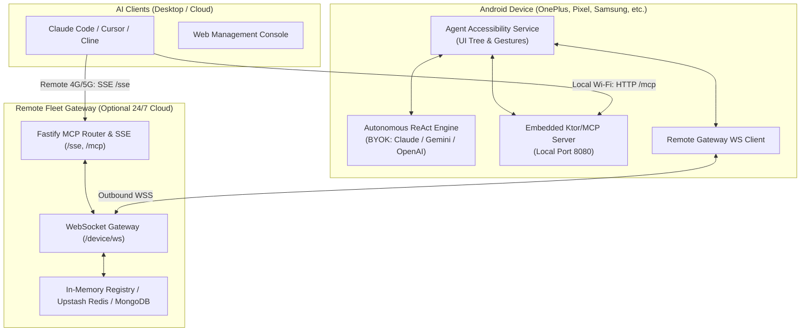

# Android MCP Agent 🤖📱

[](https://opensource.org/licenses/Apache-2.0)
[](https://developer.android.com)
[](https://fastify.io)
[](https://modelcontextprotocol.io)

An open-source, autonomous AI agent and **Model Context Protocol (MCP)** server running directly on Android. Allows AI clients (such as **Claude Code**, **Cursor**, **Cline**, or custom agents) to see, inspect, and control physical Android devices locally or over the internet.

---

## 🌟 Key Features

- **🧠 Autonomous ReAct Loop**: Runs multi-step autonomous goals directly on your phone with live reasoning, visual verification, and UI grounding.
- **🔌 Built-in Local MCP Server**: Exposes an embedded HTTP/SSE MCP server on the phone (`http://<phone_ip>:8080/mcp`) for zero-backend, instant local Wi-Fi control.
- **🌐 Remote Fleet Gateway**: Connect your phone over **4G/5G mobile data** to a lightweight cloud backend using persistent WebSockets (`wss://`). Control your phone from anywhere in the world.
- **🔑 Bring Your Own Key (BYOK)**: Supports **Google Gemini**, **Anthropic Claude**, **OpenAI**, **Groq (ultra-fast)**, and **Ollama (local models)**.
- **🛡️ Safety & Privacy First**: Zero telemetry. Real-time safety policy engine flags high-risk actions (SMS, payments, settings changes) and requests on-device user confirmation before proceeding.
- **⚡ Snappy & Lightweight**: Sub-second gesture response, debounced accessibility tree parsing, and HTTP/2 connection pooling.

---

## 🏗️ Architecture



---

## 📱 Quickstart: Mobile App (APK)

### 1. Download & Install
1. Download the latest `app-debug.apk` from the **[GitHub Releases](https://github.com/your-username/android-mcp/releases)** page.
2. Install the APK on your Android device (Android 8.0+; Android 11+ recommended for gestures and screenshots).

### 2. Enable Accessibility Service
1. Open the **Android Agent** app.
2. Tap the top warning banner or go to **Android Settings > Accessibility > Downloaded Apps**.
3. Toggle **Agent Accessibility Service** to **ON**.

### 3. Add Your AI API Key
1. In the **Agent Chat** tab, tap the **Key** icon (🔑) or settings icon (⚙️).
2. Select your provider (**Google Gemini**, **Anthropic Claude**, **OpenAI**, or **Groq**).
3. Paste your API key. (Saved locally in encrypted SharedPreferences).

---

## 💻 Connecting AI Clients (Claude Code, Cursor, MCP)

### Mode A: Local Wi-Fi (No Backend Required)
If your computer and phone are on the same Wi-Fi network:

1. Open the app and tap the **Server & MCP** tab.
2. Make sure the server status shows **Active** (Running on `http://<phone_ip>:8080`).
3. Add the MCP server directly to **Claude Code**:
```bash
claude mcp add --transport sse android http://<PHONE_IP>:8080/sse
```
Or for standard HTTP MCP transport:
```bash
claude mcp add android http://<PHONE_IP>:8080/mcp
```

### Mode B: Remote 4G/5G Gateway (Control from Anywhere)
If your phone is on mobile data away from home:

1. Deploy the free backend (see below) or connect to your hosted gateway.
2. In the app's **Remote Fleet Gateway** card, enter:
   - **Gateway URL**: `wss://<your-backend-domain>/device/ws`
   - Tap **Connect Fleet Gateway**.
3. In Claude Code, connect to your cloud gateway:
```bash
claude mcp add --transport sse android https://<your-backend-domain>/sse
```

---

## ☁️ 1-Click Cloud Deployment (Backend)

The backend is fully containerized and includes in-memory fallbacks for Redis & MongoDB, meaning it can run as a single free service without external database configurations.

### Option 1: Deploy to Render (100% Free Forever, No Credit Card)

[](https://render.com/deploy)

1. Fork this repository to your GitHub account.
2. Click the **Deploy to Render** button above or link your repo in [Render.com](https://render.com).
3. Select the **Free** plan. It will automatically build and start your gateway.

### Option 2: Run with Docker Compose (Local or VPS)
```bash
cd backend
docker compose up -d
```
The server will boot on port `3000` with local NGINX load balancer, Redis, and MongoDB.

---

## 🛠️ MCP Tools Exposed

| Tool Name | Parameters | Description |
| :--- | :--- | :--- |
| `android_get_screen` | `filterText?` | Returns visible UI elements, classes, resource IDs, and clickable bounds. |
| `android_take_screenshot` | - | Returns a high-resolution base64 JPEG screenshot of the current screen. |
| `android_execute_action` | `action` (JSON) | Executes low-level actions: `CLICK`, `LONG_CLICK`, `TYPE`, `SCROLL`, `SWIPE`, `KEY_EVENT`, `OPEN_APP`. |
| `android_run_goal` | `goal`, `maxSteps?` | Triggers the autonomous on-device ReAct reasoning loop to achieve a high-level goal. |

---

## 🔒 Safety & Privacy

- **Local Execution**: UI parsing and touch gestures run 100% on the device.
- **Confirmation Guards**: Dangerous actions (sending messages, payments, uninstalling apps) trigger an interactive on-device dialog before executing.
- **Encrypted Storage**: API keys and tokens are stored in private app storage.

---

## 📄 License

This project is licensed under the **Apache License 2.0** — see the [LICENSE](LICENSE) file for details.
